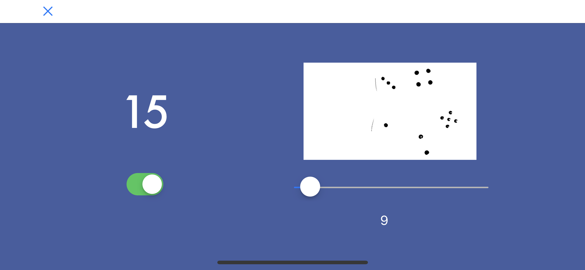

# DieSee (pronounce as dicey)

Die face summing app, which uses connected component labelling and blob detection. Takes picture (without ios prompt), uses flash based on user preferance, and allows user to set threshold on detection to adjust for lighting/background conditions. 

Uses connected component labelling from spwhitt:
https://github.com/spwhitt/cclabel

Objective C code for AVDevice access from cvp:
https://forum.omz-software.com/topic/3665/capturing-photos-without-the-ios-screen/17
